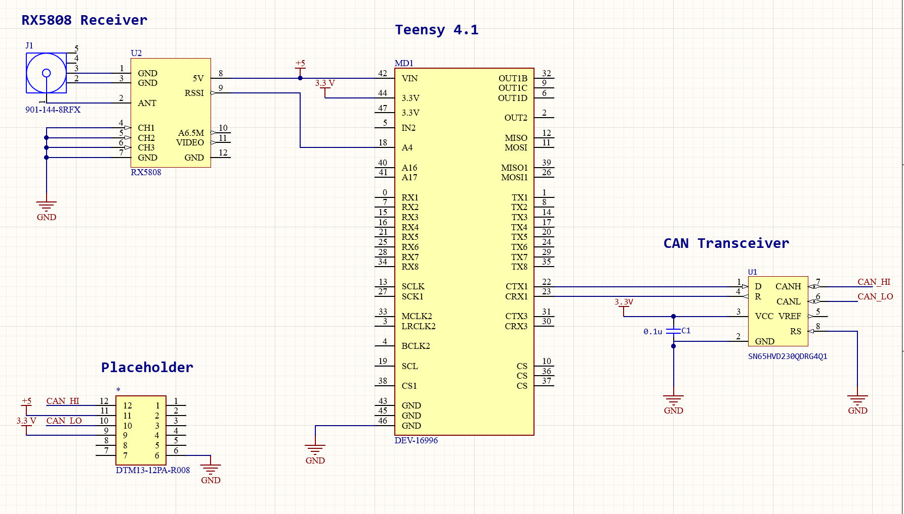

# Teensy Lap Timer

This project provides two lap timing implementations for a Teensy 4.1 microcontroller, designed for timing laps in applications such as racing. The project includes:

## Simple Lap Timer (millis-based)
A basic lap timer that uses the `millis()` function to measure and display lap times. This method is sufficient for applications that don't require high precision, with times displayed in `MM:SS:MS` format (minutes, seconds, and milliseconds).

## Advanced Lap Timer (IntervalTimer-based)
A more precise lap timer that leverages the Teensy's `IntervalTimer` for accurate timing using hardware interrupts. This implementation achieves higher precision than millis(). 

The millis() timer implementations displays lap times on the serial monitor, and I am currently working on implementing CAN functionality to be able to display the laptims on ECUMaster on the driver dashboard. For both timers, the project includes an RSSI-based trigger mechanism to detect when a lap is completed. The `IntervalTimer`-based solution provides more accurate timing by handling interrupts at precise intervals, making it ideal for more demanding timing scenarios.

## Features
- **Simple `millis()`-based lap timer** for general timing purposes.
- **Advanced `IntervalTimer`-based lap timer** for high-precision timing.
- **Real-time RSSI (Received Signal Strength Indicator)** reading to detect lap triggers.
- **Lap time formatting in `MM:SS:MS`** (with millisecond precision up to 3 digits).

## Components
- Teensy 4.1 Development Board
- RX5808 5.8G AV Receiver Module
- AKK Wireless 5.8GHz FPV Transmitter 
- Micro SD Card (to store RSSI data)
  
## Schematic

